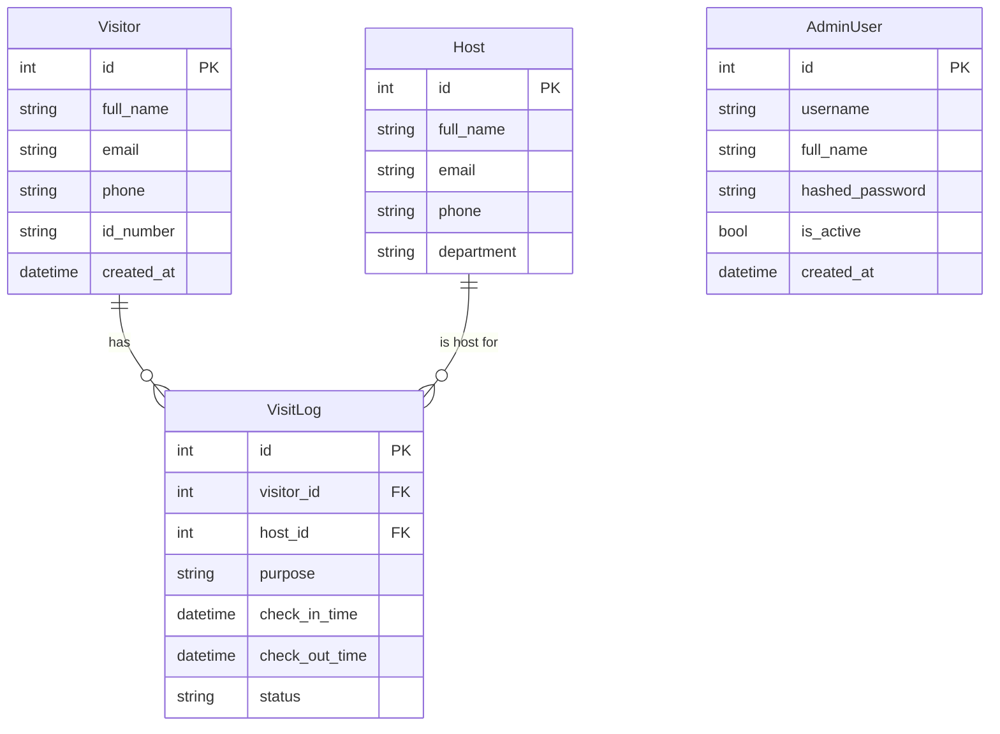

# Visitor Management Backend (FastAPI)

This is the backend service for the Self-Service Visitor Management Kiosk, built with FastAPI and using SQLAlchemy with PostgreSQL. It provides robust, extendable RESTful APIs for AI-driven visitor check-in, identity verification (OCR), speech features (STT/TTS), validation, notifications, and admin operations.

---

## Table of Contents

- [Architecture Overview](#architecture-overview)
- [Entity-Relationship Diagram](#entity-relationship-diagram)
- [Setup Instructions](#setup-instructions)
- [API Overview & Example Workflows](#api-overview--example-workflows)
  - [Visitor Check-In (Conversational)](#visitor-check-in-conversational)
  - [ID Card OCR Upload](#id-card-ocr-upload)
  - [Speech-to-Text (STT) and Text-to-Speech (TTS)](#speech-to-text-stt-and-text-to-speech-tts)
  - [Notifications](#notifications)
  - [Admin Dashboard APIs](#admin-dashboard-apis)
  - [Real-time Validation](#real-time-validation)
- [Extending & Customizing](#extending--customizing)
- [Development & Testing](#development--testing)
- [Requirements & Environment](#requirements--environment)

---

## Architecture Overview

The backend exposes RESTful API endpoints to the Next.js frontend kiosk and admin dashboard. It performs business logic, validates and stores visitor data, integrates with AI services (OCR, TTS, STT), validates user input, and sends notifications.

Major Components:
- FastAPI App (`src/api/main.py`)
- SQLAlchemy ORM Models (`src/api/models.py`)
- PostgreSQL Database (configurable in `.env`)
- AI Service Wrappers (`ai_services.py`)
- Notification Integrations (SMTP, Twilio, webhooks)
- Alembic for database migrations

#### High-level component diagram
```mermaid
flowchart TD
    F[Frontend (Next.js)]
    B[FastAPI REST API]
    DB[PostgreSQL<br/>DB]
    OCR[AI Services:<br/>OCR/STT/TTS]
    NOTIFS[Notifications:<br/>SMTP/Twilio/Webhooks]

    F -- "Calls REST APIs" --> B
    B -- "ORM" --> DB
    B -- "Invokes" --> OCR
    B -- "Dispatches" --> NOTIFS
```

---

## Entity-Relationship Diagram

Core entities stored in the database:



---

## Setup Instructions

### 1. Prerequisites

- Python 3.9+
- PostgreSQL
- Pipenv, Pip, or Virtualenv (recommended)
- Clone this repository

### 2. Install Dependencies

Create a virtual environment (optional but recommended):

```bash
python3 -m venv venv
source venv/bin/activate
```

Install Python dependencies:

```bash
pip install -r requirements.txt
```

### 3. Configure Environment

Create a `.env` file containing your PostgreSQL and notification settings:

```
POSTGRES_USER=youruser
POSTGRES_PASSWORD=yourpassword
POSTGRES_DB=visitordb
POSTGRES_HOST=localhost
POSTGRES_PORT=5432
FRONTEND_URL=http://localhost:3000
# Optional for notifications:
SMTP_HOST=smtp.yourdomain.com
SMTP_PORT=587
SMTP_USER=your@email.com
SMTP_PASS=yourpassword
SMTP_FROM=Your Kiosk <kiosk@email.com>
TWILIO_ACCOUNT_SID=your_sid
TWILIO_AUTH_TOKEN=your_token
TWILIO_FROM=+1234567890
NOTIFY_WEBHOOK_URL=https://hooks.slack.com/services/xxxx
```

### 4. Initialize the Database

Set up the database schema with Alembic:

```bash
alembic upgrade head
```

### 5. Run the API

Start the FastAPI app (e.g., with Uvicorn):

```bash
uvicorn src.api.main:app --reload --host 0.0.0.0 --port 8000
```

Visit [http://localhost:8000/docs](http://localhost:8000/docs) for interactive API docs.

---

## API Overview & Example Workflows

Refer to generated OpenAPI docs (`/docs` endpoint) for full details.

### Visitor Check-In (Conversational)

1. **POST `/api/visitor/checkin-step`**  
   Progresses step by step through conversational form.

   ```json
   {
     "conversation_state": {},
     "user_input": "Alice Smith",
     "input_mode": "text"
   }
   ```

   Responds with next prompt and expected field.

2. Submit each answer, carrying forward `conversation_state` until `is_complete` is `true`.

3. **POST `/api/visitor/checkin-finalize`**  
   Finalizes check-in (requires all fields), creates Visitor/Host/VisitLog.

   ```json
   {
     "full_name": "Alice Smith",
     "email": "alice@example.com",
     "phone": "1234567890",
     "id_number": "ID12345",
     "purpose": "Business meeting",
     "host_email": "bob@company.com"
   }
   ```

   Responds with complete `VisitLogOut` object.

---

### ID Card OCR Upload

**POST `/api/ocr/upload-id`**

Upload an image (form-data, field = `file`) to extract fields from the ID card or passport.

Response includes extracted fields or demo data.

---

### Speech-to-Text (STT) and Text-to-Speech (TTS)

- **POST `/api/speech/stt`**: Upload audio to receive transcript.
- **POST `/api/speech/tts`**: POST JSON `{ "text": "Welcome", "language": "en" }`, receive WAV audio stream.

---

### Notifications

**POST `/api/notifications/notify-host`**

Triggers e-mail, SMS, or webhook notifications to the host when a visitor arrives.  
Payload example:

```json
{
  "host_email": "bob@company.com",
  "visitor_name": "Alice Smith",
  "visitor_info": { "id_number": "ID12345" },
  "purpose": "Business meeting",
  "message": "Alice Smith has arrived for your meeting."
}
```

---

### Admin Dashboard APIs

- **GET `/api/admin/visitors`** — Paginated list of all visitors.
- **GET `/api/admin/visitlogs`** — Visit logs (recent first).
- **GET `/api/admin/hosts`** — All hosts.
- **GET `/api/admin/users`** — All admin users.

---

### Real-time Validation

**POST `/api/validation/validate-field`**  
Validate fields (email, phone, id_number) in real time as visitor fills form.

```json
{ "field": "email", "value": "alice@example.com" }
```

Returns: `{ "field": "email", "value": "...", "is_valid": true }`

---

## Extending & Customizing

- Add your AI models for OCR, STT, or TTS in `/src/api/ai_services.py`.
- Adjust conversation or prompts in `visitor_checkin_step`.
- Update notification logic for company flows (e.g., adding Slack or MS Teams).

---

## Development & Testing

- Use `uvicorn` for local dev with hot reload.
- Use `.env` to test different notification or DB settings.
- Run database migrations with Alembic.
- Run/test with tools like `curl`, Postman, or directly from the Next.js frontend.

---

## Requirements & Environment

See `requirements.txt` for all dependencies.

**Key environment variables:**
- `POSTGRES_USER`
- `POSTGRES_PASSWORD`
- `POSTGRES_DB`
- `POSTGRES_HOST`
- `POSTGRES_PORT`
- `FRONTEND_URL`
- (Notification-related: `SMTP_*`, `TWILIO_*`, `NOTIFY_WEBHOOK_URL`)

---

For more, see `/docs` (OpenAPI) when the API is running.

